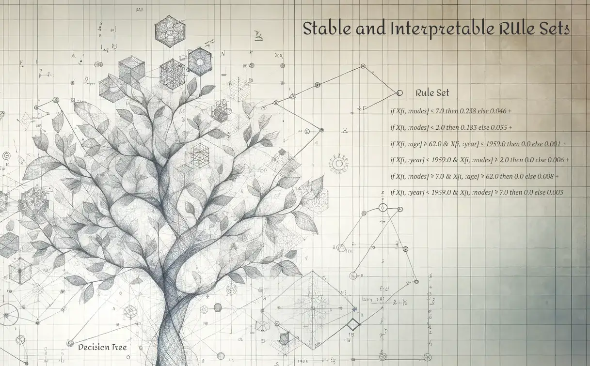

# SIRUS.jl

This package is a pure Julia implementation of the
**S**table and **I**nterpretable **RU**le **S**ets (SIRUS) algorithm.
The algorithm was originally created by Clément Bénard, Gérard Biau,
Sébastien Da Veiga, and Erwan Scornet
([Bénard et al., 2021](http://proceedings.mlr.press/v130/benard21a.html)).
`SIRUS.jl` has implemented both classification and regression.
Performance is generally the best on classification tasks;
especially when tuning the `max_depth`, `max_rules`, and `lambda` hyperparameters.

For R users, the original version of the SIRUS algorithm is available via
[CRAN](https://cran.r-project.org/web/packages/sirus/index.html).
The source code is available under the GPL-3 license at <https://gitlab.com/drti/sirus>.
Compared to the R version, this Julia implementation implements multi-class classification
and is more easy to inspect than the original R and C++ implementation.
The original algorithm is implemented in about 10k lines of C++ and 2k lines of R code,
whereas the Julia implementation is about 2k lines of pure Julia code.
Furthermore, this implementation is integrated with the `MLJ.jl` machine learning ecosystem.
With this, multiple benchmarks are executed and checked with every test run.
The results are listed in the GitHub Actions summary.

The algorithm is based on random forests.
Random forests perform generally very well;
especially on datasets with a relatively high number of features compared to the
number of datapoints ([Biau & Scornet, 2016](https://doi.org/10.1007/s11749-016-0481-7)).
However, random forests are hard to interpret because of the typically thousands
of trees in the forest.
Interpretability methods such as [SHAP](https://en.wikipedia.org/wiki/Shapley_value#In_machine_learning)
alleviate this problem slightly, but still do not fully explain predictions.
Put differently, it is not possible to reproduce predictions on the features'
importance that SHAP reports.
Also, interpretability methods convert the complex model to a simplified representation.
This causes the simplified representation to be different from the complex model
and may therefore hide biases and issues related to safety and reliability.
SIRUS solves this by simplifying the complex model and then using
the simplified model for predictions.
This ensures that the same model is used for interpretation and prediction.

## Where to Start?

- [Basic Example](/dev/basic-example)
- [Advanced Example](/dev/binary-classification)

## Acknowledgements

Thanks to Clément Bénard, Gérard Biau, Sébastian da Veiga and Erwan Scornet for
creating the SIRUS algorithm and documenting it extensively.
Special thanks to Clément Bénard for answering my questions regarding the implementation.
Thanks to Hylke Donker for figuring out a way to visualize these rules.
Also thanks to my PhD supervisors Ruud den Hartigh, Peter de Jonge and Frank Blaauw,
and Age de Wit and colleagues at the Dutch Ministry of Defense for providing
the data clarifying the constraints of the problem and for providing many
methodological suggestions.
